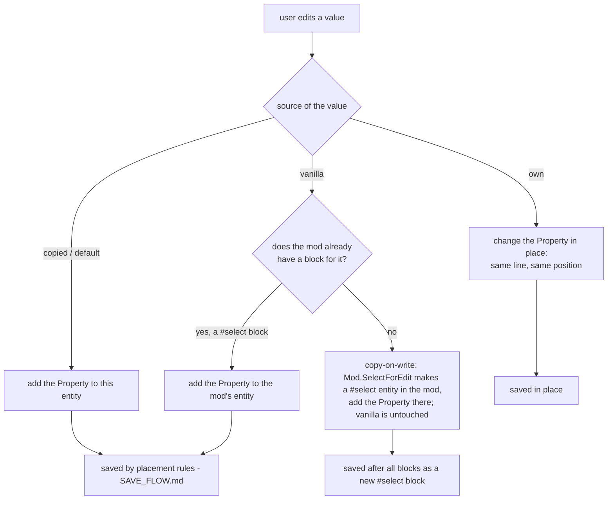

# Edit flow: what a modder wants, and what the editor does about it

The intentions behind editing a mod, what the editor should show and do for each, and how that
maps onto the model and the saved file. Read with `SAVE_FLOW.md` (how the file is read and
written) before changing editing behavior. Sections marked **(target)** describe behavior not
built yet; **(now)** describes the current code.

Goal: a **complete Dom6 mod editor**. Every entity type editable, every command the game reads
editable somewhere, structured features (weapons, armor, magic, recruitment, ...) in real
panels, and nothing a modder wrote ever lost.

## What a modder is trying to do

| # | Intention | Example |
|---|---|---|
| I1 | See what a thing *is in game* | "What does this unit end up with after the mod's copies and clears?" |
| I2 | Change a vanilla thing | Give the vanilla Militia 12 HP |
| I3 | Change something the mod defines | Raise a mod unit's attack |
| I4 | Change a template and have its copies follow | Every copy of the "Elite Guard" base gets +1 prot |
| I5 | Change one copy only | One copy of the base gets a different weapon |
| I6 | Add or remove abilities, weapons, armor, magic, recruits | Add a second weapon; swap a path |
| I7 | Undo a change, or put a value back to what it inherits | "Reset HP to vanilla" |
| I8 | Create or delete an entity | New unit, new weapon for it **(v1.1)** |
| I9 | Know what can't be changed, and what does nothing | Leadership bonus with no command; `#morale` (the game reads `#mor`) |
| I10 | Save without losing anything | Comments, order, odd formatting the game accepts |

## What the editor shows: where each value comes from

Every value on screen has one source, and the source decides what an edit does.

| Source | Shown as | Editable? | An edit... |
|---|---|---|---|
| **Own**: set in one of this entity's blocks | normal | yes | changes that line in place |
| **Vanilla**: from vanilla data, the mod doesn't set it | inherited ("inh") | yes | adds the value to the mod's `#select` block for it (copy-on-write) |
| **Copied**: from this entity's `#copystats`/`#copy*` source | inherited | yes | adds the value to this entity, after its copy line |
| **Game default**: nothing sets it, the game uses a fixed or derived value (resource size = size, cast time 100, spirit sight for horrors) | inherited, default value | yes | adds the value like any other |
| **Game value**: stored in the game's data, no command sets it (leadership bonus, part-6 armor) | read-only, locked | no | — |
| **Not read**: a command the game ignores for this entity type (`#morale`, `#mountedinspector`) | "n/r", locked | no (can be removed) | — |

Removing a value removes the line that sets it. An *inherited* value can't be removed by
deleting a line, because the line is in vanilla or in the copy source. The game offers:
- numeric abilities: setting 0 removes the ability (the game's ability setter, tools/dom6exe);
- flags, weapons, armor, magic: only the group clears (`#clearspec`, `#clearweapons`,
  `#cleararmor`, `#clearmagic`), after which everything else in the group has to be added back.
**(target)** The editor offers "remove inherited" and writes the right form: `#x 0` for a
numeric ability; for the others, the group clear plus the rest of the group, shown before it's
done because it rewrites the group.

## What an edit does to the model and the file

Placement rules for a property added to an entity that has blocks (`SAVE_FLOW.md`):
1. a replacement goes where the removed property of the same command was;
2. otherwise the end of the entity's first block, unless a later block sets the same command,
   clears its group or copies over it; then the end of its last block;
3. **(target)** a copy or clear command (`#copystats`, `#clear...`) goes right after the block's
   header, before the entity's own properties: added at the end, the game would replay the
   entity's own lines first and then the copy would overwrite them.

Why the first block: copies made after it pick up the change (I4, rule C: an edit to a template
reaches every copy that doesn't set the field itself). I5 works because the copy's own value
goes after its `#copystats` line and wins.

## Structured features: what the game does with each command

What an added line does to a value the entity already has (vanilla or copied), from the game's
parser (tools/dom6exe). This decides what an edit panel has to write.

| Feature | Add / change | Remove one inherited entry |
|---|---|---|
| Stats (`#hp`, `#att`, ...) | `#hp 12` replaces | — (always has a value) |
| Numeric ability (`#fear 5`) | replaces (or appends, for repeatable ones like `#batstartsum1`) | `#fear 0` (the ability setter removes on 0) |
| Flag (`#flying`) | sets it | no command: `#clearspec`, then add back every other ability and flag |
| Magic path (`#magicskill 4 3`) | replaces the level if the monster has that path, else adds it | no command (level 0 isn't accepted): `#clearmagic`, then add back the rest |
| Random magic (`#custommagic`) | always appends a new entry | `#clearmagic`, then add back the rest |
| Weapons / armor (`#weapon`, `#armor`) | appends to the free slots | `#clearweapons` / `#cleararmor`, then add back the rest |
| Item slots, body shape | replace | — |

So editing an inherited value is usually one line, but *removing* an inherited multi-valued entry
rewrites its whole group. **(target)** Panels do that rewrite themselves and say so ("removes
via #clearweapons and re-adds 2 weapons") before applying it.

## Undo, dirty state, save

- Every edit is an `IEditCommand` executed through `CommandHistory` (undo/redo). **(target)**:
  every edit, including name, copy commands and resets (some bypass it now, see below).
- Undo restores the exact previous model state, including which Property object sits in which
  block, so an undone edit saves exactly as before.
- Save: one writer for everything, the mod's own (`ModExporter`, file order, unedited lines as
  read), written to a temp file and swapped in, the previous file kept as `.bak`
  (`SafeFile`).

## Panels

Simple commands are badges (flag, number, reference) defined in `Dom5Editor/Data/*_badges.json`.
Structured parts get panels: monster weapons/armor/magic/shapes/summons, nation recruitment and
start units, spell effects and requirements, item and site specifics. **(target)** every
command the game reads for an entity type is editable in a badge or a panel; measured against
`Dom5Edit/GameData/game-commands-*.json`.

## Current state **(now, 2026-10-05)**

From a map of the editor's code:
- **No copy-on-write.** A vanilla-only entity's view model holds the shared vanilla object
  (`MainWindowViewModel.LoadEntities`, source `Vanilla`) and every edit changes it in place.
  Vanilla is never reloaded, so edits survive New/Load and "modified from vanilla" compares the
  object with itself. Entities the mod `#select`s get the mod's entity (`VanillaModified`) and read
  through to vanilla in the view model (`GetProperty`), which is the shape copy-on-write needs.
- **Edits that bypass undo:** the name setter, copy-command setters (`CopyStatsId` etc.), weapon
  `Damage`, in-place custom magic edits; `Reset*` helpers exist but nothing calls them; ModInfo
  edits (`#modname`, `#version`, ...) set the mod's fields directly with no undo or dirty flag.
- **Bless and Template edits throw** in `CommandHistory.GetEntityType` (no case for them).
- **Magic path edit** (`OnMagicPathLevelChanged`) changes the *first* `#magicskill` property,
  not the one for the edited path.
- `HasSessionChanges` is never reset; weapon/armor adds are recorded twice in `ChangesMod`.
- **Save** goes through `ChangesModExporter`: a loaded mod is written by the file-order writer
  (since 2026-10-05); a new mod by the old merge, which drops `#version`/`#domversion`/`#icon`
  and keeps only one value per command for edited entities.

## Roadmap: a complete editor

Each step is checked with scripted edits (`Dom5Tests edit`) and `Dom5Editor --snapshot` renders
before it counts as done. The existing views are treated as unverified: each one is checked,
and rewritten where it's wrong.

**E1. One edit model (M3).**
1. **Copy-on-write**: the first edit of a vanilla-only entity makes the mod's `#select` entity
   (`Mod.SelectForEdit`), the view model switches to it (source `VanillaModified`) and the edit
   goes there. One entry point (`EntityViewModel.EnsureEditable`) used by every edit path.
2. **One writer**: Save = `Mod.Export` (file order for a loaded mod, canonical for a new one),
   written safely with a `.bak`. `ChangesModExporter` goes.
3. Fix the bypasses (name, copy commands, damage, custom magic) to go through undo, and the
   magic path edit to target its path; Bless/Template history types.

**E2. Show what the game sees.** Every shown value comes from one resolver that replays the
mod the way the game reads it (vanilla, then each block in file order: copies, clears,
replace-or-append per command, from tools/dom6exe), and says where each value came from (the
source table above). Views read it instead of each doing its own vanilla/copy lookups.

**E3. Every entity, every command.** Verify and rewrite each view; real panels for the
structured parts: monster weapons and armor, magic paths and random magic, leadership, item
slots, shapes, summons; nation recruitment, start units, sites, pretenders; spell effects,
damage and requirements; item effects; site specifics; events. Spell and gold costs shown
decoded; game values with readable labels. Remove-inherited writes the group rewrite (above).
`tools/editor_coverage.py` reaches zero missing.

**E4. Browsing and navigation.**
- Entity lists: search by name or ID; toggles to show/hide vanilla, mod-edited and mod-new
  entries (hiding vanilla makes the list just the mod's work), remembered per tab; sortable
  stat columns per type (weapons: damage, attack; armor: protection, defence, encumbrance;
  monsters: HP, size, cost); sprites in the monster and item lists.
- Every reference is a link: a monster's weapons, armor, copy source, shapes and summons; a
  nation's recruits and start units; a spell's summoned unit; an item's weapon. Clicking opens
  the referenced entity; Back/Forward history (Alt+Left/Right, mouse buttons).
- "Used by": the entities that refer to this one (monsters with this weapon, nations recruiting
  this unit, copies of this template), each a link.
- Jump anywhere (Ctrl+P): one search box over every type by name or ID.
- Pickers for references: searchable, with ID, key stats and a vanilla/mod marker, and the same
  hide-vanilla toggle.
- Create from a reference: "new weapon for this monster" makes the weapon and attaches it.
- Keyboard: Ctrl+S, Ctrl+Z/Ctrl+Y, Ctrl+F to the list search, Delete removes the focused
  value. The window remembers its layout, tab and selection.

**E5. Robustness and packaging** (PROJECT_EVALUATION.md section 8).

## How this is verified

- Core: `Dom5Tests edit` scripted edits through the same entity calls as the editor (fidelity
  stage 4), saves compared by data and by file.
- UI: **(target)** `Dom5Editor --snapshot`: load a mod, open an entity's view off-screen, apply
  edits through its view model, render to PNG for review.
