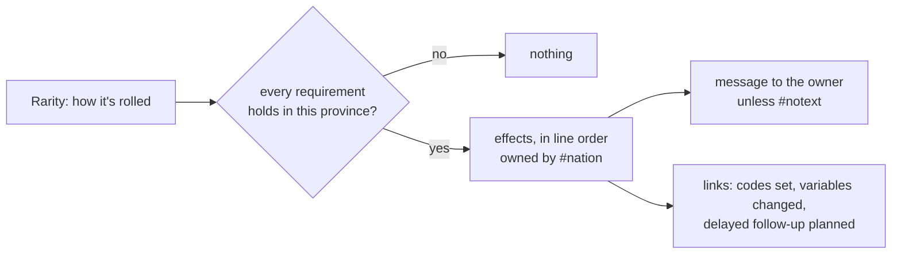
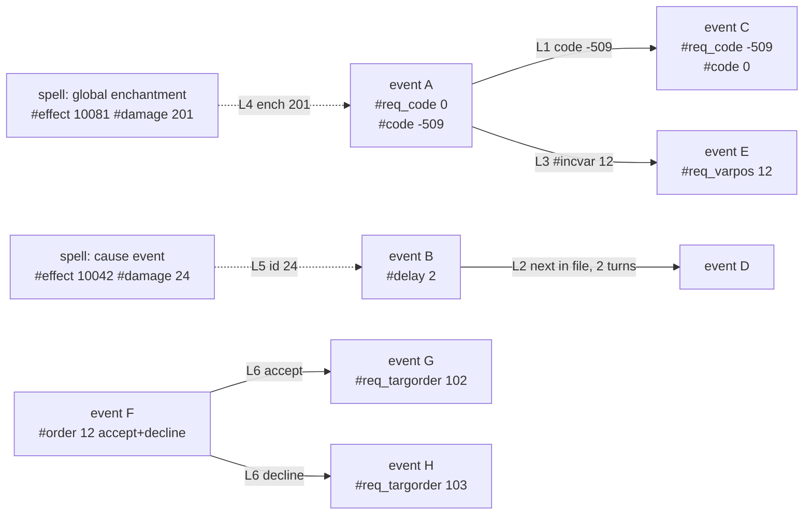

# Events: how they work, how they chain, and the editor for them

How Dominions 6 events behave (from the event modding manual, `dom6eventman.pdf`, ver 6.29,
text in `docs/pdf_extracted/eventman.txt`, and the 6.37 exe's parser, `tools/dom6exe`), how
they connect to each other and to the rest of a mod, and what the editor does with that. Read
with `EDIT_FLOW.md` (editing in general) and `SAVE_FLOW.md` (the file).

## An event, in one picture

An event is a script: **when** (requirements) and **then** (effects), plus a message. It has no
name and no number of its own: a mod writes `#newevent ... #end`, and the editor numbers events in
file order (the game gives them records 3500, 3501, ... in the order it reads them).
`#selectevent N` changes one of the game's own events (0-3301 in 6.37).

**Rarity** decides how it's rolled (manual p. 2):

| Rarity | Kind | Rolled |
|---|---|---|
| 1 / 2 | common / uncommon **bad** | randomly, per province, by luck/turmoil |
| -1 / -2 | common / uncommon **good** | randomly |
| 0 | **always** | every month, every province where it's valid; at most one rarity 0 per province per month |
| 5 | always, **unlimited** | like 0, any number per province (global-enchantment effects) |
| 10 / 11 / 12 | always / common / uncommon **global** | planned 7 months ahead (fortune tellers see them) |
| 13 | always **immediate global** | at once |

**Requirements** (`#req_*`, ~200 commands) are all "and"; some repeatable ones are "any of"
(`#req_code`, `#req_fornation`, `#req_targmnr`, `#req_targorder`, ...). A group of `#req_targ*`
picks one **target commander** that must meet all of them; target effects (`#transform`,
`#xp`, `#killtarg`, `#*boost`, ...) then act on that commander.

**Effects** run in line order, and the order matters: `#tempunits`, `#assowner`,
`#assfollower*` change the units/assassins made by the lines *after* them; `#cleartarg` drops
the target for what follows; `#delayskip` belongs right after its `#delay`. Requirements have
order too: `#req_path` sets the path `#req_pathgems` then checks, `#req_school` the school for
`#req_minresearch`.

**Messages** can name a site or item in brackets at the end (`[Hidden Gem Deposits]`): site
requirements and effects with a `<0|1>` or `-1` argument (`#req_site 1`, `#revealsite`,
`#addsite -1`), `#magicitem 9` and `#addequip 9` use that name. Tags like `##landname##`,
`##targname##`, `##godname##` are filled in; at most 2399 characters.

## How events chain

Six mechanisms connect an event to others. DomEnhanced 2.13 (1,700 events) uses all of them.

| # | Link | Sets (in the earlier event) | Checks (in the later event) | DomEnhanced |
|---|---|---|---|---|
| L1 | **Province event code** | `#code`, `#code2` (globals: when executed), `#codedelay`/`#codedelay2` (after this/next turn's events); `#code 0` ends a chain; `#resetcode*` clears a code from the world | `#req_code` (any of), `#req_notcode`, `#req_anycode`/`#req_notanycode` (anywhere in the world), `#req_nearbycode`, `#req_nearowncode` | 17 codes (-300..-315, -540) |
| L2 | **Delayed follow-up** | `#delay`/`#delay25`/`#delay50 N`: the **next event in the file** (the next record number: the next `#newevent`) happens N turns later (and never on its own); `#delayskip p`: p% chance the one after it instead | (position in the file) | 51 delays, chains up to 4 long |
| L3 | **Event variable** (global, 0-9999; -1..-4 = per nation / player / province) | `#clearvar`, `#incvar`, `#decvar`, `#inc10var`, `#dec10var`, `#invvar`, `#togglevar` | `#req_varpos`, `#req_varneg`, `#req_varzero`, `#req_varone`; `#var0units` reads var 0 | 11 counters |
| L4 | **Enchantment** | a spell: global/province enchantment effects (81, 82, 84, 85 and 10081...) with `#damage` = enchantment number | `#req_ench`, `#req_noench`, `#req_myench`, `#req_friendlyench`, `#req_hostileench`, `#req_enchdom`, `#req_enchtarget`, `#req_enchnearby`; owner: `#nationench`, `#assownerench` | 96 enchantments, 1,000+ events |
| L5 | **Spell-caused event** | a spell with effect 42 / 10042, `#damage` = the event's `#id` | `#id N` on the event | 66 events, 22 spells |
| L6 | **Player choice** | `#order mask` offers province orders (investigate 1, continue 2, accept 4, decline 8, withdraw 16, attack 32, diplomacy 64, subterfuge 128, magic 256) | `#req_targorder 100-108` (the commander's chosen order), usually with `#req_code` | site search (`#req_targorder 7`) on 402 events |

Other entities events use (each a reference the editor links): monsters (`#com`, `#Nd6units`,
`#assassin`, `#transform`, `#req_monster`, `#req_targmnr`, ...; negative = monster tag),
nations (`#nation`, `#req_fornation`, `#extramsg`, ...), sites (`#addsite`, `#removesite`,
`#req_nositenbr`; by name in the message brackets), items (`#req_targitem`, `#req_worlditem`;
by name for `#magicitem 9`), poptypes (`#setpoptype`, `#req_poptype`).

What can go wrong (and the editor checks):
- a code that's checked but never set (or set but never checked): a dead end or an orphan;
- an event that sets a code without `#req_code 0` (manual: it can break other chains);
- codes outside -300..-5000 (manual: vanilla and other mods use the rest);
- a `#delay` on the last event of the file (no follow-up), or a follow-up that also has a rarity
  that makes it happen on its own (it won't: "will not occur normally");
- a site/item requirement or effect with no `[Name]` at the end of the message, or a name that
  isn't a site/item;
- a `#req_targ*` effect (`#transform`) with no target requirement (it picks any commander);
- `#worldritrebate` outside rarity 11/12; `#req_pregame` without an always rarity;
- a message naming the target commander (`##targname##`, `##targhis##`) with no `#req_targ*`
  requirement to pick one (DomEnhanced: 430 events use the tags, all with one).

## The editor

### E-1. The model: `Dom5Edit.Events` **(now)**
- `EventGraph.Build(mod, vanilla)`: every link above as `EventLink(from, to, kind, key, via)`
  (event-to-event for L1-L3 and L6, spell-to-event for L4-L5), the chains (connected
  groups of events through L1-L3/L6), and the problems list.
- `EventInfo`: an event's derived title (its message's first sentence, or the header line with
  `#header 2`, or a summary of its effects: "Gold +500 when enchantment 201 is active"), its kind
  (rarity row above), and its role (starts a chain, follow-up, global effect, spell event).
- Checked by `Dom5Tests events <mod.dm>` (chains, links and problems listed; DomEnhanced as the
  fixture).

### E-2. One description per command: `Dom5Editor.Core/Data/event_commands.json` **(now)**
Every event command the game reads: its group (the manual's sections), whether it's a
requirement or an effect, a sentence ("The province has code {v}"), its argument kind
(number, percent, 0/1 yes-no, nation, monster, site, item, code, variable, enchantment, path,
gem, scale, school, season, month, era, order, order mask, affliction mask, terrain mask, fort,
rarity) and value names. Written by hand from the manual; the hover hints are the manual's
own text (`command_hints.json`, `tools/command_hints.py`).

### E-3. The event page: a script you can read **(now)**
- **Header**: the title (from the message), kind (rarity as words), owner (`#nation`: province
  owner, random enemy, independents, a nation), and a one-line summary.
- **When**: requirements as sentences grouped like the manual (time, nation, province, sites,
  dominion, scales, monsters, mages, target commander, codes, enchantments, variables), each
  value editable in place (choices for enumerated values, pickers for references, toggles for
  0/1), with a picker of every requirement by group.
- **Then**: effects as sentences **in line order**, with move up/down (order matters), and the
  same pickers.
- **Message**: a big box, buttons for the `##tags##`, the bracketed site/item name recognized
  and linked, a preview with sample values, the 2399-character limit.
- **Chain**: what leads here and what this leads to, by link kind ("sets code -509 → *The crypt
  opens*", "2 turns later → *Celebrations complete*", "spell *Gaia's Vengeance* (enchantment
  233)"), each a link; the event's problems.

### E-4. Browsing **(now)**
- The event list shows titles and kinds, with filters: kind (good/bad/always/global), chains
  only, by enchantment or spell, by nation; search covers message text.
- **Chain map** (on the event page): the chain as a flow graph (events as cards, links as
  labelled arrows: code, delay, variable, choice, blocks), laid out left to right; clicking a
  card opens the event. Spells that start it are cards on the left. A chain over 40 events
  shows the events within two links of this one.

### E-5. Making chains **(now)**
From an event's Chain section:
- **Follow-up when the code is set**: picks the next free code in -300..-5000 (or the one this
  event already sets), adds `#code X` (and `#req_code 0` if it requires no code) here, and
  makes a new event at the end of the file with `#rarity 0`, `#req_code X`, `#code 0` (not
  next to this one: there it could become a `#delay`'s next event).
- **Delayed follow-up (N turns)**: adds `#delay N` here and makes a new event placed right after
  this one in the file (the game picks the next event).
- **Player choice**: `#order` with the chosen orders and a code here; one new event per choice
  with `#req_code X` and `#req_targorder`.
- **Event for a spell**: from a spell page with an enchantment or cause-event effect, make an
  event that checks it.
Each new event gets this event's owner (`#nation`, `#nationench`): the default owner is the
independents, who would otherwise get the follow-up's gold and units. New events go through
`ModEditor` like every edit (one undo step); a delayed follow-up is placed after its event in
the file (`SavePlan` order).

### E-6. The game's own events (read-only) **(now)**
The exe stores vanilla events in a table: per event the message, the rarity, up to 12
requirement and 20 effect (code, value) pairs. Requirements and effects are numbered
separately (`#req_code` stores requirement 59, `#code` effect 93, `#decscale3` effect 59).
`tools/dom6exe events` writes them to `tools/dom6exe/data/events-6.37.dm`: 3,302 events
(0-3301) as `#selectevent N` blocks, rarity, requirements and effects in stored order. The
messages are the game's text, so they aren't in the file (as vanilla.dm has no descriptions):
its header says where they are in this exe (checksum, file offset, record and message size),
and the editor reads them from the player's own Dominions6.exe (`--messages` writes them in,
for local use).
97.4% of the 20,095 pairs are written as the command that stores them; the rest are codes no
command writes (`-- ro: effect 190 (gold) = 300`), shown read-only. Lines a mod couldn't
reproduce carry a comment (the same non-repeatable code twice, a value outside the command's
range). Dom5Parser parses the file (`Dom5Tests events` on it: 3,302 events, 4,808 links, 63
chains). For browsing and for `#selectevent N`: shown read-only, with a mod's `#selectevent`
changes on top. Not editable directly.

In the editor (d648482): the file loads with vanilla.dm (shipped next to the editor as
`vanilla-events.dm`), and `Dom5Edit.Events.VanillaEventMessages` reads the messages from the
player's exe (`DOM6_EXE`, or the usual Steam folders) as display assets, only if the record
after the last event reads "end" where the header says (another game version reads nothing).
The Events list has all 5,000 (DomEnhanced: its 1,700 and the game's 3,300 it doesn't change),
titled from their messages, numbered, and searchable by message text. The event graph links
the game's events too (DomEnhanced: 5,729 links, 89 chains; the game's code chains such as
"The natives are complaining" -> "unruly" -> ... read as in game), with `#delay` to the next
record. A game event's page shows its message (with a note that it isn't saved), its lines
and chain; lines that stack (the catalog: commands that add a pair, most effects) are
read-only and none can be removed (only `#clear` empties an event, and that drops the
message too); lines that replace (most requirements) can be changed, and lines can be added
(`#selectevent N` with the mod's lines). Checks look only at the mod's lines.

From the code (`tools/dom6exe/README.md`, Events):
- `#selectevent N` is record N. Mod events (`#newevent`) are records 3500, 3501, ... in the
  order the game reads them.
- `#delay` plans the next record number (+2 with a successful `#delayskip`), not the next block
  in the file.
- A list holds 12 requirements and 20 effects; further lines are dropped. A non-repeatable
  command replaces the pair with its code; repeatable ones append.
- `#clear` sets the rarity to 98 (free): the event never happens until a new `#rarity`, and the
  next `#newevent` takes the record again. So does a `#newevent` block without `#rarity`.

## Open questions (in-game checks)
- Answered from the code: the "next" event for `#delay` is the next record. After a
  `#newevent` that is the next `#newevent` the game reads (a `#selectevent` block in between
  doesn't count; after a mod's last event, the next mod's first); after `#selectevent N`, event
  N + 1. Still to confirm in game.
- Whether `#code` in a non-global event is set before or after the other effects (matters for
  `#req_code` in another event the same month).
- Whether the order of requirement lines matters beyond `#req_path`/`#req_school`.
