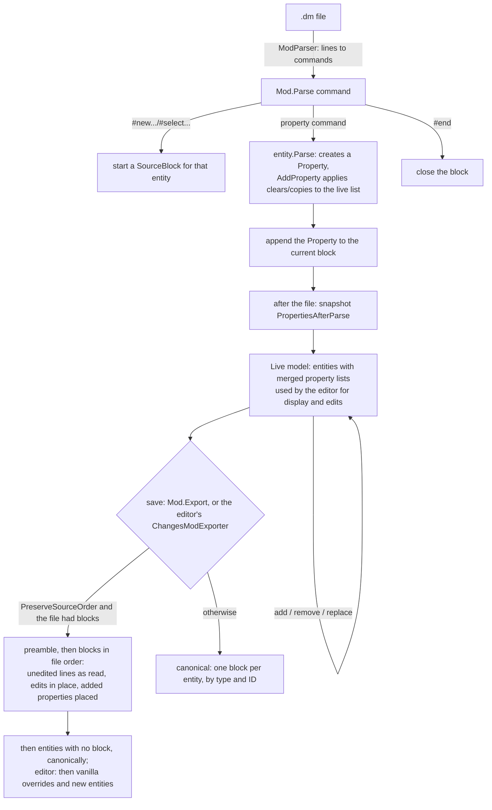

# Save flow: parse, edit, save in original order

How a mod goes from file to memory to file, and why each step is the way it is. Read this
before changing parsing, editing or export. Code locations are given per step; tests at the end.

Status (2026-10-05): implemented. DomEnhanced 2.13 (about 130,000 lines) loads and saves
**byte-identical**; the inspector sees 0 differences (it was 873 with the canonical writer).
Scripted edits change exactly what they edit, including the template cascade (rule C).

## The rule everything follows

**The game reads a mod top to bottom, and each block changes the entity as it stands at that
point.** A `#copystats` copies the source *as it is at that line*; a `#clearspec` clears what was
set *before it*; a later `#selectmonster` block changes the entity *after* everything above it.
So the meaning of a mod depends on the order of its blocks.

The old save wrote each entity as one block, by type and ID. That reorders blocks and changes
the meaning: a copy made before its source was edited now sees the edit (DomEnhanced: 873
differences, most of them this). Saving the blocks back in file order keeps the meaning without
the editor having to re-derive copies.

## Flow

## Parse (code: `Mod.Parse(Command, ...)`, `ModParser`, `IDEntity.Parse`)

1. A `#new...`/`#select...` line selects or creates the entity (`NewEntity`, `SelectEntity`) and
   starts a `SourceBlock` (`Dom5Edit/Mod/SourceBlock.cs`): the entity, whether the header was
   `#select` or `#new`, the header's argument and line as read, the entity's ID then, and the
   comment/blank lines just before it.
2. Each property line goes to the entity (`IDEntity.Parse` → `AddProperty`), which keeps the
   **live list**: clears and copies remove what they override (`ApplyClearCommand`,
   `ApplyCopyCommand`) and copies capture a snapshot of their source (`CaptureCopySnapshot`).
   The same `Property` object is appended to the block (`IDEntity.LastParsedProperty`).
3. `#end` closes the block (its line kept).
4. Lines that give the entity nothing are kept as text where they were (`Mod.AddTrivia`): blank
   and comment lines, `#dependency`, unknown commands, commands the entity doesn't accept,
   commands outside any block. Before the first block they form `Mod.Preamble` with the header
   commands (`#modname`, ...); after the last, `Mod.TrailingTrivia`.
5. After the whole file, `Mod.PropertiesAfterParse` records which properties are live, and the
   header fields are noted (`Mod.HeaderUnchanged`). At the first `Mod.Resolve()`, each block
   property notes its export text (`Property.BaselineExport`).

So every property appears in exactly one block, in file order, and those taken out of the live
list by a later clear or copy are still in their block.

Texts are read as the game reads them (`tools/dom6exe/README.md` "Reading .dm files",
`GameData/GameReading.cs`): a text runs from its opening quote to the next quote, across lines.
After `#msg`, `#name` (not an item's), `#addname`, sprites, `#flag`, ... the game skips the text,
so with the closing quote missing the command lines up to the next quote are text, not commands;
a description (`#descr`, `#details`, ...) is read through, so a command inside it is read too. A
quote missing before more commands on a description is taken as forgotten (the commands are
read, as in game; only the game's text is longer). Where the game reads lines differently than
they look, the parser adds a `GameReadsDifferently` note (texts running on, `--` in a text, a
block without `#end` where the game stops or merges two events, no final line break).

## Edit (code: `Dom5Edit.Editing.ModEditor` / `Transaction`; docs/EDIT_FLOW.md for what each edit means)

Every editor change goes through `ModEditor`, which changes the entity's live list directly
(`IDEntity.InsertLive` / `ReplaceLive` / `RemoveLive`, no copy/clear side effects) and records
an undoable `IModEdit` (snapshots of the touched entities' lists). Older code paths
(`IDEntity.Set<T>`, `Create<T>`, `Remove<T>`) still exist for the merge tool.

| Edit | What happens to the model | What the save writes |
|---|---|---|
| Change a value the entity sets itself | a new `Property` takes the old one's place in the live list | the new value, **where the old one was** |
| Remove a property | taken out of the live list | nothing in its place |
| Replace (remove + add the same command) | old out, new `Property` with no block | the new one **in the old one's place** |
| Add a property the entity didn't set | new `Property` with no block | see placement below |
| New entity | entity with no block | after all blocks, as one block |
| First edit of a vanilla entity | `Transaction.Editable` makes a `#select` entity with no block (copy-on-write) | after all blocks, as one block |
| Delete an entity | gone from `Database` | none of its blocks |

**Placement of an added property** (one with no block; `SavePlan`, shared by the save and the
resolver, so what the editor shows is what the file says):
1. If an edit removed a block property of the same command from this entity, put it there.
2. An added copy or clear line, and lines added back after one (removing an inherited entry
   rewrites its group: `Property.PlaceFirst`), go **before the entity's own lines**: right after
   the last copy or clear line of its blocks that touches the same group, else right after the
   first block's header. Added at the end, the game would read the entity's own lines first and
   the copy or clear would then undo them.
3. Otherwise at the end of the entity's **first** block, unless a later block of the entity sets
   the same command, clears its group, or copies over it; then at the end of its **last** block.

Only entities changed since the file was read (`IDEntity.EditedSinceLoad`) are worked out; the
rest are written as read.

Why the first block: copies of a template are usually made after its first block, so an added
or changed value there reaches every copy that doesn't set the field itself. That is rule C (an
edit to a template carries to copies whose value matches and that don't set the field), and it
comes from the game's own order instead of editor logic. Why the exception: a value put before a
later `#clear` or later value of the same command would not take effect.

## Original text (`Property.RawText`, `Property.SaveText`)

An unedited line is written back exactly as it was read; only lines an edit changed are
regenerated. This keeps what the property types don't capture: `#immortal 3` (the game reads
only the command word), `#homecom` with no argument, `#moreorder -0`, references by name,
spacing inside multi-line strings, and comments.

- Parse: each property keeps its line's text (`Property.RawText`: the whole line when it holds
  one command, multi-line strings with their lines as read; on a line with several commands,
  each its part). Multi-line strings also keep their trailing spaces in the value now.
- After the first `Mod.Resolve()`, each block property records its export text
  (`Property.BaselineExport`). At save, a property whose export text still equals it is
  unedited: its `RawText` is written. Otherwise the regenerated text is.
- A header is written as read unless the entity's ID changed. The preamble is written as read
  unless a header field changed; then the header is regenerated and the preamble's other lines
  follow. A clone of a property (`Property.Clone`) is a new line: no `RawText`.

## Save (code: `ModExporter.WriteInSourceOrder` over a `SavePlan`; the editor's Save is the same, `EditorSession.Save`)

The preamble, then for each block in file order, unless its entity was deleted:
- its leading lines, then the header;
- each block property (with the block's other lines at their positions):
  - live now → `SaveText()` (as read if unedited);
  - live after parse but not now → removed by an edit: skip it, but write a replacement placed
    in this slot (rule 1);
  - not live after parse → a later clear or copy took it out: write it (the game reads it);
- added properties placed at the end of this block;
- the `#end` line.

Then the trailing lines, then entities with no block, each as one block by type and ID. Falls
back to the canonical writer when the mod has no blocks (built in the editor), when
`PreserveSourceOrder` is false, or when entities were disabled (`DisableMages`, merge-only).

The editor's Save (`MainWindowViewModel.SaveMod` → `ChangesModExporter`) writes the loaded mod this
way (its edits to the mod's own entities are already in those entities), then edits to vanilla
entities the mod doesn't select (#select blocks from `ChangesMod`) and new entities. It falls back
to the old merged export if entities were removed in the session.

`Mod.NormalizeCopies` (re-derive copies, bake divergent values) is for the canonical writer
only: in file order the copies replay as written.

A regenerated line (an edited one, or every line with `KeepOriginalText = false`) keeps what
the author wrote where the game reads it the same: references keep their form (a name stays
the name as spelt, unless its target was renamed in the editor; numbers only in a merge,
`Mod.KeepReferenceForms`), unresolved references (another mod's) are written, extra values are
kept as a note, and a block without `#end` stays without one.

### Safeguards (`Mod.SafeSave`, `ModBackups`, `SafeFile`)

- Opening a mod copies its file to `%APPDATA%\Dom5Editor\backups\<name>-<hash>\` ("opened");
  each save copies the file it replaces first ("before-save"). 30 kept per file; no copy when
  the newest has the same bytes. The editor's menu opens the folder.
- A save is written to a temporary file that must read back with the same entities, type by
  type (`SaveCheck`), before it replaces the mod's file; if not, the file stays as it was and the
  attempt is kept beside the backups (`*_failed-save.dm.txt`).
- Saving into Steam's workshop folder asks first (updates overwrite it). A crash with unsaved
  edits writes a recovery copy (`%APPDATA%\Dom5Editor\recovery`).

## Known gaps

- Lines kept as text (unknown commands, commands the entity doesn't accept) aren't editable and
  don't reach the entity; they're only preserved.
- The editor edits vanilla entities on the shared vanilla object and records them in
  `ChangesMod`; saved after the mod's blocks. (Copy-on-write via `SelectForEdit` is what the
  test harness does.)
- `ChangesMod` keys changes by command, so it can't tell two values of a multi-valued command
  apart; the original-order path doesn't depend on it for the mod's own entities.
- The editor's display of a copy walks the source's live values; it doesn't replay the file.
- A deleted entity's comment lines go with it.

## Tests

- `node tools/fidelity/run.mjs --quick`: stage 3 (load → save, the inspector sees the same data)
  and stage 4 (scripted edits, `Dom5Tests/fixtures/edits/*.json`): e07 template cascade with a
  copy that sets the field itself, e09 replacement in place (rule 1), e10 added ability after a
  later `#clearspec` (rule 2), e11 added ability on a template reaches its copies. e09 and e10
  fail if their rule is broken (checked by breaking them).
- `Dom5Tests roundtrip in.dm out.dm` then `cmp`: an unedited save is byte-identical (DomEnhanced).
- Because unedited lines are written as read, that alone doesn't test the export. Stage 3's
  `domenhanced-2.13-regen` saves with every line regenerated (`Mod.KeepOriginalText = false`,
  `roundtrip ... regen`), still in file order; its baseline is 2, equivalences the game treats
  the same (`-0` for `0`).
  `Dom5Tests edit ... editorsave` saves through the editor's exporter; on e01-e11 it writes the
  same files as `Mod.Export`.
- Fixtures in `Dom5Tests/fixtures/copy/` (order-dependent copy, forward reference, clear mid
  entity, copyspr after copystats, name before copy).
- `Dom5Tests check MOD OUTDIR [--with NEEDED.dm]`: one mod as the editor sees it (parser notes,
  Validate, every entity resolved, events), the author report (`NAME.report.md`), an unedited
  save that must be byte-identical and pass `SaveCheck`, and `NAME.regen.dm` with every line
  regenerated for the inspector to compare (`roundtrip_check.js MOD NAME.regen.dm --at final`).
  On the 16 installed workshop mod files (2026-10-07): all byte-identical; the regenerated files
  agree with the inspector except where it reads `#descr` like `#msg` (Confluence; two spells
  in FR and Sombre) and keeps tabs.
